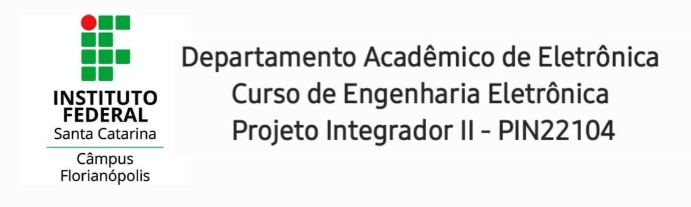

# Domótica - Projeto Integrador II
**Repositório destinado ao projeto com tema Domótica da turma de Projeto Integrador II, ano de 2021, do curso de Engenharia Eletrõnica do IFSC-Florianopolis.**

Clicando nos tópicos abaixo será possivel ver com mais detalhes as etapas de criação e implementação do projeto:

 * [Introdução à Domótica](/introducao.md)
 
 * [Concepção do Projeto](/concepcao.md)
 
 * [Design](/design.md)

 * [Implementação](/implementacao.md)
 
 * [Operação](/operacao.md)
