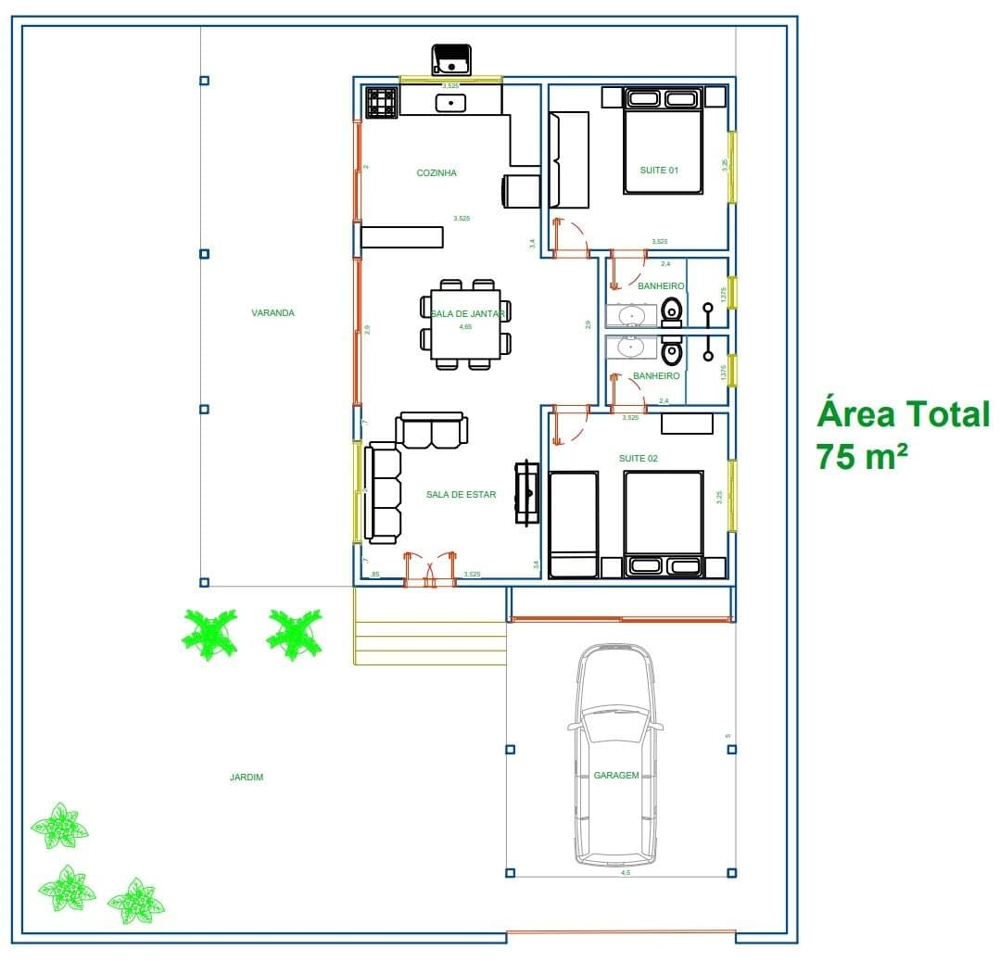

# Concepção do Projeto 

Este projeto tem como base a construção do protótipo de uma casa, com o objetivo de automatizar algumas funcionalidades dela e assim mostrar como seria o uso da demótica em uma residência real e, como isso, tornar o dia a dia mais prático e tecnológico.

## O Projeto

Este projeto foi pensado para a planta de uma casa de praia, como mostra a figura abaixo:

###### Figura 1 - Planta baixa da casa.

Nessa casa deseja-se automatizar algumas funções básicas para aumentar o conforto da casa, como também automatizar outras por questões de segurança do ambiente e das pessoas as quais estarão nela. Com base nisso pretende-se criar uma casa automatizada a qual possua as seguintes funcionalidades, onde serão implementadas e suas principais vantagens:

* Controle de iluminação de forma remota nos quartos - auxilia no controle de gastos da casa, pois caso esqueçam a luz acesa e queiram desligar, mas não tem como ir ao local podem desligar remotamente.
* Sensor de presença no jardim – este tem o mesmo viés do auxílio do gasto de energia, como também na questão de segurança da casa. Isso acontece pois, ele acende a luz quando alguém for passar pelo jardim e apaga logo depois caso não haja mais movimentos, auxiliando no controle de gastos com a iluminação, fazendo com que a luz não fique ligada o tempo inteiro como também alertando caso tenha alguma movimentação estranha no jardim.
* Sensor de gás na cozinha – ele detecta as concentrações de gases inflamáveis e informa caso tenha uma concentração muito alta. Ele auxilia na segurança da casa, pois assim pode-se evitar vários acidentes envolvendo gases inflamáveis.
* Servomotor no portão eletrônico - motor o qual vai auxiliar na  hora de abrir o portão de entrada da casa.

## Objetivos
Para realização desse projeto têm-se os seguintes objetivos:
* Traduzir requisitos do projeto em protótipo;
* Construção de uma maquete seguindo o modelo da planta fornecida;
* Implementação dos dispositivos e sensores necessários.

## Requisitos

Com base no que foi exposto cria-se a necessidade de uma lista de requisitos para o projeto, como se segue:
 * Controlar a iluminação dos cômodos;
 * Controle dos LEDs de forma remota;
 * Sensor de presença no jardim;
 * Sensor de gás;
 * Servomotor portão eletrônico.
