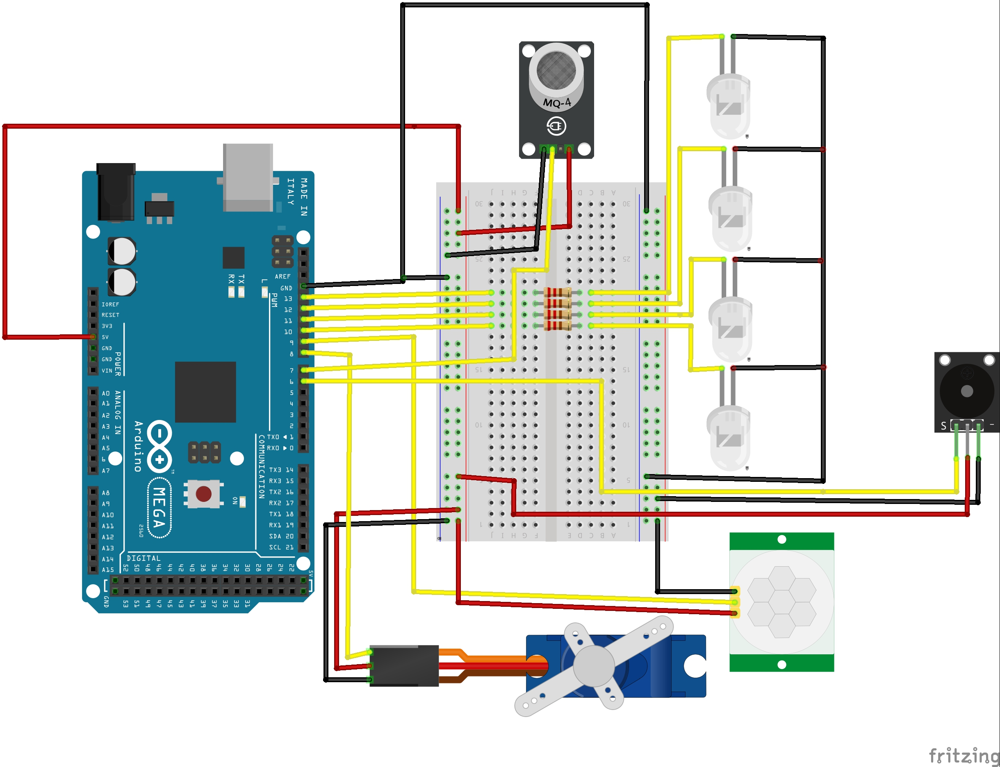
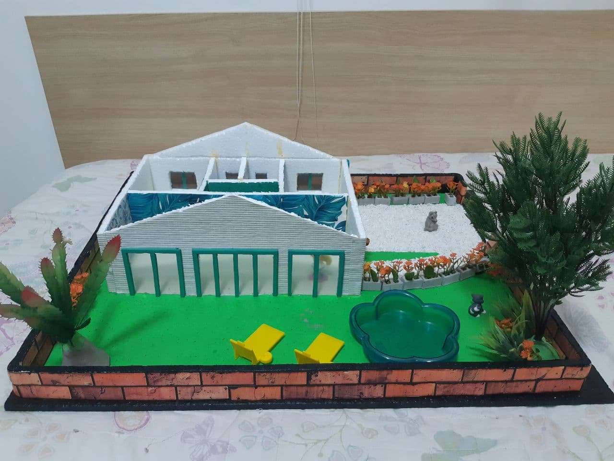
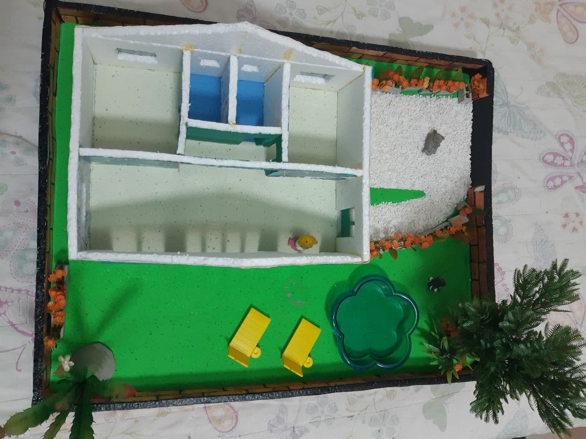
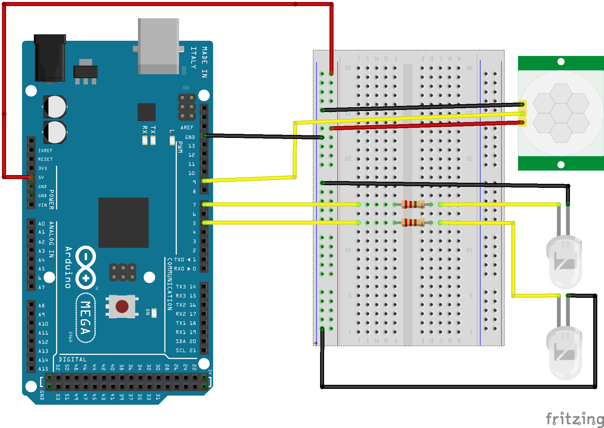
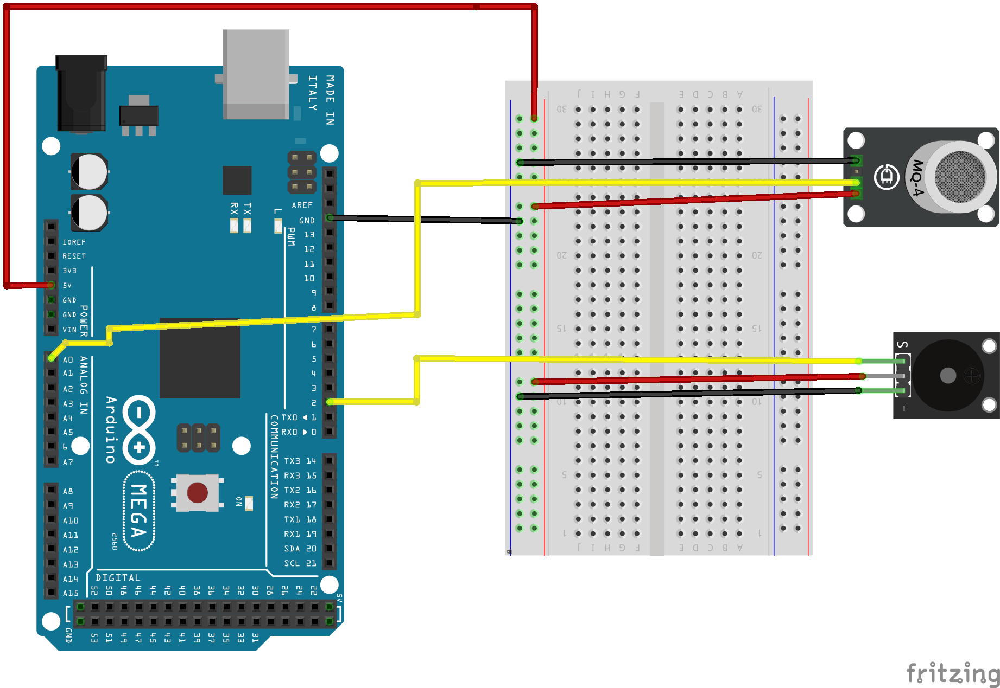
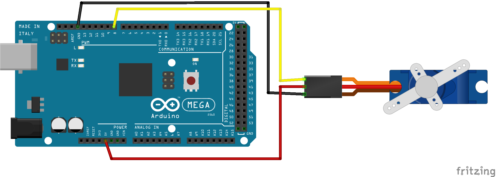

# *Design*
O intuito desse projeto é a construção do protótipo de uma casa, com o objetivo de automatizar algumas funcionalidades dela. 
Dessa forma, para começar a implementação do projeto iniciou-se pensando nos componentes necessários e em como eles seriam ligados. Com base nisso, foi feita uma tabela com os componentes utilizados e uma maquete eletrônica que auxilia na visualização da intenção do *design*. Além disso, esta parte do projeto baseou-se também na construção da maquete que representa-rá a casa do projeto, além dos testes individuais dos componentes e o entendimento do funcionamento destes.

## Componentes necessários 

Componente   | Quantidade
--------- | ------
LED Branco | 4
Micro Servo SG90| 1
Módulo Buzzer 5V Passivo | 1
Sensor de Gás MQ2 | 1
Sensor de Movimento Presença PIR | 1
Resistores | 4
Arduino Mega 2560 | 1

Além desses componentes é importante lembrar que será usado uma quantidade de fios para a ligação, uma fonte DC chaveada de 9V, um cabo para ligar o Arduino no computador e, no caso do esquemático, foi usada uma matriz de contatos(*protoboard*) para facilitar a ligação dos componentes.

## Maquete Eletrônica

Para uma melhor representação das ligações feitas foi criado o seguinte esquemático: 

###### Figura 1 - Maquete eletrônica do projeto.

Essa figura mostra as ligações  dos seguintes componentes e suas funções no projeto: LEDs, usados na iluminação; sensor de presença que aciona um dos LEDs; sensor MQ2, que é o responsável por detectar gases inflamáveis; buzzer que é acionado pelo sensor de gás; e por último o servo motor, responsável por abrir e fechar a cancela na entrada da casa.

## Construção da Maquete
Para a construção da maquete, foi usado a planta apresentada na parte da concepção do projeto como base. Dessa forma foram usadas placas de isopor para criar sua estrutura, além de tintas, papeis coloridos e plantas artificiais para dar um ar mais realístico. A seguir estão fotos da maquete finalizada:
###### Figura 2 - Maquete vista lateral.

###### Figura 3 - Maquete vista superior.

## Teste dos Componentes
Nessa etapa, foram testados individualmente os componentes e apresentadas suas principais características, para assim se ter um bom entendimento do funcionamento de cada um. Além disso, será apresentada a representação das ligações realizadas fisicamente por uma representação digital feita utilizando o *softwere* *Fritzing*.

### Sensor de Presença(PIR) e LEDs
O PIR é um sensor que capta a radiação infravermelha de um corpo e assim aciona o que for desejado. Ele é um sensor capaz de detectar o movimento de corpos que emitam calor e que estejam em seu campo de alcance. A sensibilidade do alcance e do tempo de duração do sinal podem ser ajustados no próprio sensor.

Para o teste desse sensor ele e dois LEDs distintos foram ligados à placa do Arduino. Quando o sensor estiver desativado(sem movimento) o LED vermelho está ativo e o branco desativado e, quando o sensor detecta movimento, o LED branco ativa e o vermelho desativa. Isso foi feito conforme o esquemático abaixo e segundo o código que pode acessar [aqui](./codigos/Teste_PIR_LEDs.ino).
###### Figura 4 - Esquemático teste PIR com LEDs.

### MQ2 e Buzzer
O sensor MQ2 é um sensor que consegue identificar a presença de gases infumáveis ou fumaça em um ambiente. Quando ele detecta esses gases ele envia um sinal, que pode ser tanto analógico como digital, ao microcontrolador conectado, nesse caso o Arduino. No caso desse projeto, sempre que o sensor detectar uma quantidade limite de gás ele aciona um buzzer.
O buzzer é um dispositivo piezoelétrico reverso, o qual funciona a partir de uma diferença de potencial aplicada em seus terminais, com uma determinada frequência, dessa forma a célula dentro dele irá vibrar na mesma frequência emitindo um som.

Para o teste do sensor MQ2 utilizou-se ao mesmo tempo, o Buzzer, pois esse emite um sinal sonoro quando o sensor MQ2 indica que as concentrações de gases passaram do valor  limite. O esquemático abaixo representa como foi montado os componentes para teste e [aqui](./codigos/Teste_MQ2_Buzzer.ino) o código usado para o teste.

###### Figura 5 - Esquemático teste MQ2 e Buzzer.

##### **OBS:** Nesse esquemático usou-se o sensor MQ4 pois era o único disponível no programa utilizado, mas no teste real utilizou-se o MQ2.

### Servo Motor
O Servo Motor é em grande parte utilizado para controle de movimento que exigem posicionamento de alta precisão. Eles são motores comuns que possui acoplado a ele um sensor de velocidade e um controlador. Ele trabalha com servo-mecanismo que usa o feedback de posição para controlar a velocidade e a posição final do motor.

Para o seu teste ele foi ligado ao Arduino conforme a imagem a seguir e foi usado o código que pode ser acessado [aqui](./codigos/Teste_Servo.ino).
###### Figura 6 - Esquemático teste Servo Motor.

## Referências

OLIVEIRA, Euler. **Como usar com Arduino - Sensor PIR (Detector) de Movimento.** Disponível em: <https://blogmasterwalkershop.com.br/arduino/como-usar-com-arduino-sensor-pir-detector-de-movimento>. Acesso em: 16 ago. 2021.

DOS REIS, Fáio. **Como funciona um Sensor de Movimento PIR – Passive Infrared.** Disponível em: <http://www.bosontreinamentos.com.br/eletronica/como-funciona-um-sensor-de-movimento-pir-passive-infrared/>. Acesso em: 16 ago. 2021.

PORTA, Leonardo Dalla. **SENSOR DE GÁS ARDUINO MQ-2 PARA GASES INFLAMÁVEIS E FUMAÇA.** Disponível em: <https://www.usinainfo.com.br/blog/sensor-de-gas-arduino-mq-2-para-gases-inflamaveis-e-fumaca/>. Acesso em: 16 ago. 2021.

BEZERRA, Victor Hugo Igino.**Buzzer ativo ou passivo. Qual é o ideal para o seu projeto?** Disponívem em: <https://www.adrobotica.com/buzzer-ativo-ou-passivo-qual-e-o-ideal-para-o-seu-projeto/>. Acesso em: 16 ago. 2021.

SILVEIRA, Cristiano Bertulucci.**Servo Motor: Veja como Funciona e Quais os Tipos.** Dispnível em: <https://www.citisystems.com.br/servo-motor/>. Acesso em: 16 ago. 2021.

[*Software* usado para as maquetes eletrônicas ](https://fritzing.org/)
