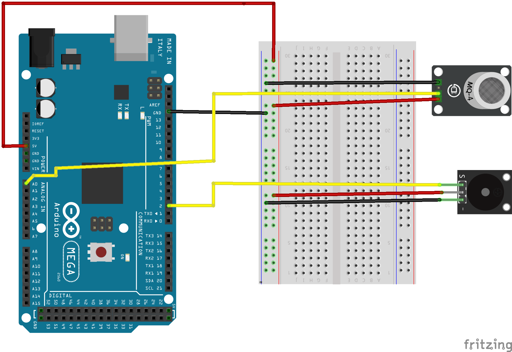

# Implementação
Esta parte do projeto baseou-se na construção da maquete que representa-rá a casa do projeto, além dos testes individuais dos componentes e o entendimento do funcionamento destes.

## Construção da Maquete
Para a construção da maquete, foi usado a planta apresentada na parte da concepção do projeto como base. Dessa forma foram usadas placas de isopor para criar sua estrutura, além de tintas e papeis coloridos para dar um ar de casa real. A seguir estão fotos da maquete finalizada:
###### Figura 1 - Maquete vista lateral.

###### Figura 2 - Maquete vista superior.

## Teste dos Componentes
Nessa etapa, foram testados individualmente os componentes e apresentados suas principais características, para assim se ter um bom entendimento do funcionamento de cada um. Além disso, será apresentada a representação das ligações realizadas fisicamente por uma representação digital feita utilizando o *softwere* *Fritzing*.
### Sensor de Presença(PIR) e LEDs
O PIR é um sensor que capta a radiação infravermelha de um corpo e assim aciona o que for desejado. Ele é um sensor capaz de detectar o movimento de corpos que emitam calor e que estejam em seu campo de alcance. A sensibilidade do alcance e do tempo de duração do sinal podem ser ajustados no próprio sensor.
Para o teste desse sensor eu liguei ele e dois LEDs distintos a placa do Arduino. Quando o sensor estiver desativado(sem movimento) o LED vermelho está ativo e, quando o sensor detecta movimento o LED branco ativa. Isso foi feito conforme o esquemático abaixo e segundo o código apresentado a seguir:
###### Figura 3 - Esquemático teste PIR com LEDs.

### MQ2 e Buzzer

###### Figura 4 - Esquemático teste MQ2 e Buzzer.

### Servo Motor

###### Figura 5 - Esquemático teste Servo Motor.

## Referências
OLIVEIRA, Euler. **Como usar com Arduino - Sensor PIR (Detector) de Movimento.** Disponível em: <https://blogmasterwalkershop.com.br/arduino/como-usar-com-arduino-sensor-pir-detector-de-movimento>. Acesso em: 16 ago. 2021.
DOS REIS, Fáio. **Como funciona um Sensor de Movimento PIR – Passive Infrared.** Disponível em: <http://www.bosontreinamentos.com.br/eletronica/como-funciona-um-sensor-de-movimento-pir-passive-infrared/>. Acesso em: 16 ago. 2021.

